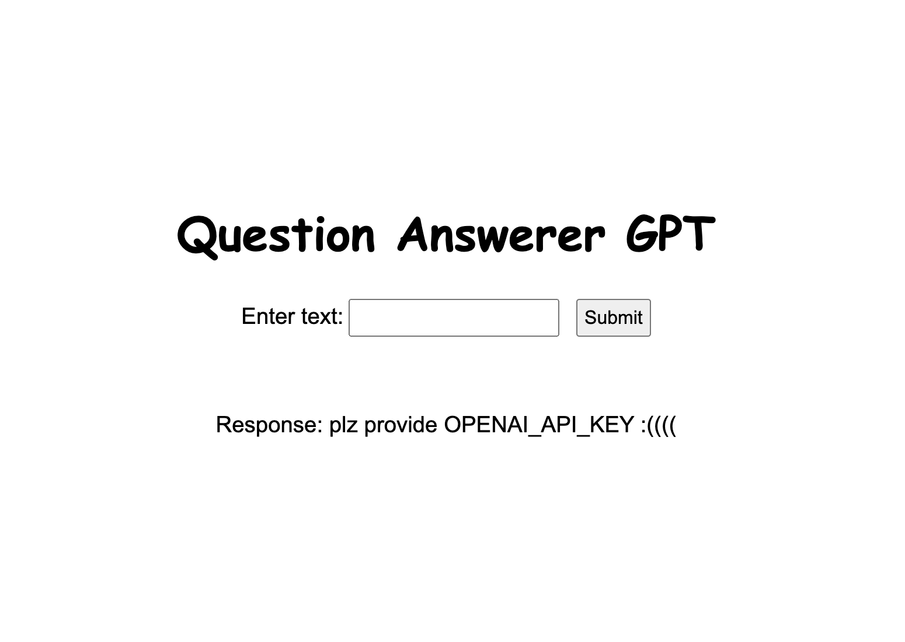

## Question Answerer GPT



To prepare data for fine tuning run :
```bash
python3 txt_to_jsonl.py /path/to/txt_files /path/to/jsonl_file
```

To finetune GPT-3 :
```bash
!python3 -m pip install openai flask
bash finetune.sh API_KEY /path/to/jsonl_file MODEL_NAME
# MODEL_NAME should be one of ada, babbage, curie, davinci
ls -lth fine_tune_model.txt
# this file should be present
```

You can then run the UI for QA:
```bash
python3 app.py API_KEY fine_tune_model.txt
```